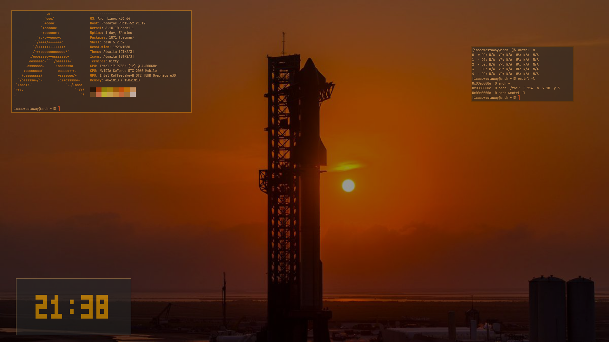

// A Banner or Logo



Overview
=======

**This window manager IS still being worked on, (hence the todo) I just do not have much time right now because im in my final year of schooling**

Zenith is a tiling window manager written in zig for extensibility and modification, in case you would like to write your own window manager with some niche features.

The reason the project is laid out as it is, is because most window managers I have came across serve their window manager in some 5 thousand line source file, which there is nothing wrong with, just making a small modification is quite difficult. Especially if it is a really minor change like being able to move around windows in firefox.
Hopefully this window manager is different.

A lot of inspiration for this window manager came from DWM and Ragnar so check it out!

Features
========

Ability to define a number of workspaces in the `config.zig`, and dynamically create more using the predefined keybind (or one you change it to) without having to re-compile in case you need more real estate

Optional integration with picom, though support for picom is ongoing as to become compliant with EWMH and ICCM

3 Color hovering, focused and unfocused system

Complete support for an animated background, using a `gif`. You need `imagemagick` installed to coalesce the gif into a series of frames, though
`magick example.gif -coalesce out.bmp`

Getting Started
===============

Prerequisites
-------------

`0.13.0` Zig compiler

Dependencies:
```
glibc
imlib2
x11
xinerama
xft
```

Building
--------

```
git clone https://github.com/isaac-westaway/Zenith

cd zenith

make all
```

Installation
------------

Your `~/.xinitrc` should look as follow:

```
exec Zenith
```

Configuration
-------------

Configuration is documented in `config.zig`

Keybinds
--------

Taking a screenshot requires the `scrot` package to be installed

Every key alphabetic key you see is in lowercase

| Function | Keybind |
| ---------------- | ------- |
| Open Terminal    | Mod4 + Return (Enter) |
| Close Window Manager | Mod4 + Escape |
| Tab cycle focus forward | Mod4 + Tab |
| Tab cycle focus reverse | Mod4 + Shift + Tab |
| Take a screenshot | Mod4 + l |
| Toggle fullscreen| Mod4 + f |
| Close currently focused window | Mod4 + q |
| Push currently focused window forward a workspace | Mod4 + p |
| Push currently ... reverse one | Mod4 + o |
| Cycle right a workspace | Mod4 + d |
| Cycle left a workspace | Mod4 + a |
| Unfocus current window (for picom aesthetics) | Mod4 + grave |
| Move Window | Mod4 + Click and drag left mouse button |
| Resize Window | Mod4 + Click and drag right mouse button |
| Add a workspace (dynamically) to the end | Mod4 + equals |
| Remove a workspace (dynamically) at the end | Mod4 + minus |
| Swap the Left and Right focused (Master, Slave) Windows | Mod4 + 1 |
| Add the current focused window as a Master to the layout | Mod4 + 2 |
| Add the current focused window as a Slave to the layout | Mod4 + 3 |


Todo
====

Bug fixes
---------
- Minor logic errors and Atom support specified in `layout.zig` and `workspace.zig`

Planned Updates
---------------
- Statusbar
- Multiple monitor support -> I just don't have another screen to work with
- Write a tutorial in the project Wiki on how to set an animated background

Currently supported atoms
-------------------------

- `_NET_NUMBER_OF_DESKTOPS`
- `_NET_CURRENT_DESKTOP`
- `_NET_CLIENT_LIST`
- `_NET_ACTIVE_WINDOW`

Contributing
============

All contributions are welcome! If you would like to contribute to this project, fork the repo, clone it, new branch, and pull request.

License
=======

This project is licensed under the MIT License
