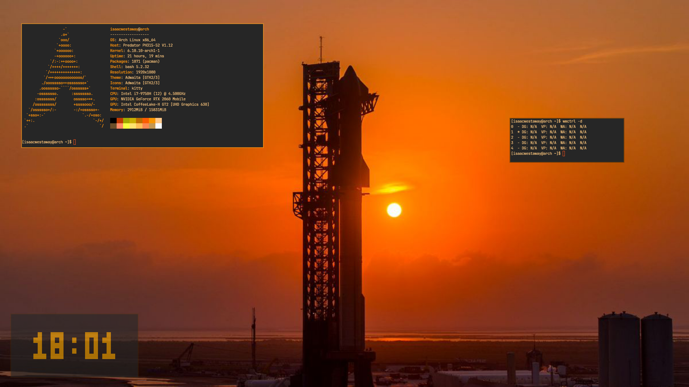

// A Banner or Logo



Overview
=======

Zenith is a tiling window manager written in zig for extensibility and modification, in case you would like to write your own window manager with some niche features.

The reason the project is laid out as it is, is because most window managers I have came across serve their window manager in some 5 thousand line source file, which there is nothing wrong with, just making a small modification is quite difficult. Especially if it is a really minor change like being able to move around windows in firefox.
Hopefully this window manager is different.

A lot of inspiration for this window manager came from DWM and Ragnar so check it out!


Features
========

Ability to define a number of workspaces in the `config.zig`, and dynamically create more using the predefined keybind (or one you change it to) without having to re-compile in case you need more real estate

Optional integration with picom, though support for picom is ongoing as to become compliant with EWMH and ICCM

Getting Started
===============

Prerequisites
-------------

`0.13.0` Zig compiler

Dependencies:
```
glibc
imlib2
x11
xinerama
xft

zlog (optional, can be found in my repositories)
```

Building
--------

```
git clone https://github.com/isaac-westaway/Zenith

cd zenith

make all
```

Installation
------------

Your `~/.xinitrc` should look as follow:

```
exec Zenith
```

Configuration
-------------

Configuration is documented in `config.zig`

Keybinds
--------

| To be Documented | Keybind |
| ---------------- | ------- |
| Open Terminal    | Mod4 + Enter |

Todo
====

- Continue EMWH & ICCM spec integration
- More todos specified in `Layout.zig` and `config.zig`
- Installation Script
- XSession config file

Contributing
============

All contributions are welcome! If you would like to contribute to this project, fork the repo, clone it, new branch, and pull request.

License
=======

This project is licensed under the MIT License